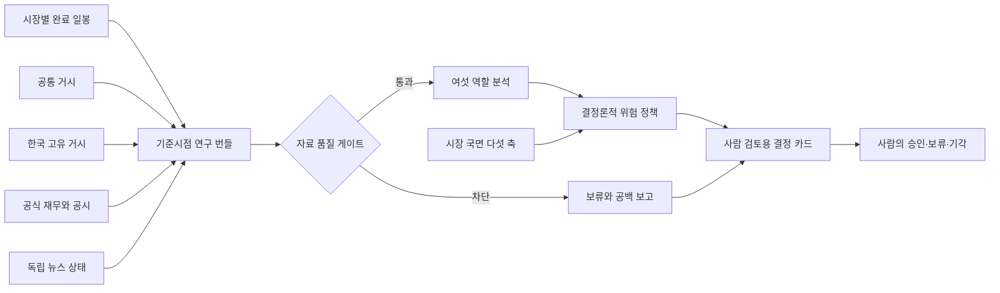

# 미국·한국 시장 연구 설계

## 목표

이 설계는 종목 점수를 많이 만드는 것이 아니라 같은 기준시점의 검증 가능한 사실을 미국과 한국 시장에 맞게 조립하고, 자료가 불완전할 때 긍정적인 결론이 실행 의견으로 넘어가지 못하게 하는 데 목적이 있습니다. 자동 주문은 범위에 포함하지 않습니다.

## 전체 구조

## 시장 분리

공통 거시는 미국과 한국에 동시에 영향을 주지만 민감도는 시장별로 따로 평가합니다.

| 구분 | 공통 사용 | 미국 시장 추가 | 한국 시장 추가 |
|---|---|---|---|
| 금리 | 미국 정책금리, 2년·3년·10년, 장단기 금리차 | 성장주 할인율과 수익률 곡선 | 외국인 자금과 한미 금리 환경 |
| 통화 | 연준 광의 달러지수, 원·달러 | 달러 강세와 해외 매출 민감도 | 원화 약세 수준과 변화에 더 높은 위험 상한 적용 |
| 변동성 | 변동성지수 수준과 변화 | 동일 | 동일하되 원화·외국인 흐름과 함께 해석 |
| 원자재 | 서부텍사스유와 브렌트유 | 업종·물가 영향 | 수입물가와 제조업 비용 영향 |
| 유동성 | 비트코인, 연준 총자산, 역레포 | 위험 선호 보조축 | 글로벌 위험 선호 보조축 |
| 성장·물가 | 미국 소비자물가, 근원물가, 실업률, 산업생산 | 직접 경기축 | 수출과 글로벌 수요의 공통 배경 |
| 한국 고유 거시 | 해당 없음 | 해당 없음 | 한국은행 기준금리, 국고채 3년·10년, 원·달러, 한국 소비자물가 |

시장 국면은 하나의 매수 점수로 합치지 않습니다. 금리·통화·변동성·원자재·유동성 다섯 축을 `우호`, `중립`, `비우호`, `미확인`으로 유지하고, 불리하거나 미확인인 축은 포지션 상한 계수만 낮춥니다.

## 출처 정책

| 자료 | 분석용 우선 출처 | 신선도·권리 정책 |
|---|---|---|
| 공통 거시 | [세인트루이스 연은 경제 데이터](https://fred.stlouisfed.org/docs/api/fred/series_observations.html) | 공식 관측일과 수집 시각을 보존하며 빈도별 허용 수명을 다르게 적용합니다. |
| 한국 거시 | [한국은행 경제통계시스템](https://ecos.bok.or.kr/api/) | 검증한 통계표와 항목 코드만 사용하고 키가 없으면 필수 구역을 차단합니다. |
| 미국 재무·공시 | [미국 증권거래위원회 자료 인터페이스](https://www.sec.gov/search-filings/edgar-application-programming-interfaces) | 회사 사실과 제출 메타데이터를 사용하며 공정 접근 사용자 식별자가 필요합니다. |
| 한국 재무·공시 | [금융감독원 전자공시](https://opendart.fss.or.kr/intro/main.do) | 인증키와 공시 접수일을 확인하고 본문 대신 검증 가능한 재무·공시 메타데이터를 저장합니다. |
| 한국 가격 | [공공데이터포털 주식시세](https://www.data.go.kr/data/15094808/openapi.do) | 통상 다음 영업일 자료임을 표시하고 비조정주가 한계를 경고합니다. |
| 미국 가격 | [티잉고 완료 일봉](https://www.tiingo.com/documentation/end-of-day) | 개인 내부 분석과 비재배포 조건을 따르며 조정 일봉을 우선 사용합니다. |
| 국내 뉴스 탐색 | [빅카인즈](https://www.bigkinds.or.kr/v2/intro/service.do), [네이버 개발자 안내](https://developers.naver.com/notice/article/32530) | 제목과 원문 위치를 찾는 탐색 단계로만 등록하고, 권리가 확인되지 않은 본문을 분석 저장하지 않습니다. |
| 계약 뉴스 | [로이터 커넥트 이용조건](https://www.reutersconnect.com/general-terms) | 인공지능 분석과 저장 권리가 계약으로 확인될 때까지 비활성입니다. |

야후 파이낸스는 미국과 한국 가격의 장애 대응용 비공식 대체일 뿐입니다. 대체가 발생하면 공급원 등급과 자료 공백에 반드시 남고 공식 자료로 가장하지 않습니다.

## 사실 원장과 기준시점

각 사실은 다음 항목을 가집니다.

- 시장과 종목을 분리한 정규 식별자.
- 출처 식별자와 공식 주소.
- 지표 이름, 값, 단위와 통화.
- 관측 시각, 공개 시각, 수집 시각.
- 공개 시각이 공식 보고값인지 관측일 대용값인지 나타내는 근거 구분.
- 정정 차수와 기준시점.

에이전트 근거는 입력 사실 식별자를 참조해야 합니다. 입력에 없는 식별자, 주소와 공개 시각을 반환하면 결과 검증 단계에서 거부됩니다. 과거 기준시점보다 늦게 관측되거나 공개된 거시 사실도 번들에서 제외합니다.

## 자료 품질 게이트

필수 구역은 다음과 같습니다.

- 현재가·직전가·일간 수익률·변동폭·20일 변동성과 최소 일봉 수.
- 공통 거시 여섯 구역.
- 한국 종목의 한국은행 거시 구역.
- 공식 재무제표.
- 공식 공시 이벤트.

선택 구역은 이동평균·상대강도 등 부가 기술 지표, 밸류에이션 비율과 독립 언론 뉴스입니다. 선택 구역의 공백은 경고로 남지만 단독으로 분석 실행을 없애지는 않습니다.

다음 조건은 신규 포지션을 차단합니다.

- 필수 구역이 부분 수집, 사용 불가 또는 차단 상태인 경우.
- 필수 사실이 허용 수명을 넘은 경우.
- 사실과 출처 식별자, 종목 또는 기준시점 참조가 충돌한 경우.
- 기본면이나 공식 공시 입력이 비어 있는 경우.

차단되더라도 분석 실행 기록과 공백 보고는 남습니다. 위험 정책은 `eligible=false`, 비중 상한 `0`, 실행 의견 `보류` 또는 더 강한 `회피`로 고정합니다.

## 재무와 비율

미국 회사 사실과 한국 전자공시에서 매출, 영업이익, 순이익, 자본, 자산, 부채, 희석 주당이익, 영업현금흐름과 설비투자를 수집합니다. 주가수익비율, 자기자본이익률, 총자산이익률과 주가순자산비율은 필요한 기간·발행주식수·평균 잔액이 모두 확보될 때만 계산합니다.

현재 계약은 다중 원천 파생 계보를 완전히 표현할 수 없는 비율을 임의 계산하지 않습니다. 계산할 수 없는 비율은 값 대신 필요한 입력을 구체적인 자료 공백으로 남깁니다. 이 정책은 잘못된 분기 이익의 연환산이나 시점이 다른 분모 사용을 막기 위한 것입니다.

## 뉴스 적용

공식 공시는 검증 가능한 기업 사건으로 뉴스 역할에 전달합니다. 독립 언론은 현재 선택 구역이며 공급원 정책과 준비 상태만 노출합니다. 다음 단계에서 전문 이용권이 확인된 제공자를 연결할 때도 제목 검색과 원문 분석 권한을 분리하고, 중복 기사 묶음·발행 시각·정정 여부·회사 연결 신뢰도를 저장해야 합니다.

## 운영과 보안

- 모든 변경 인터페이스는 로컬 호스트와 같은 출처 요청만 허용합니다.
- 외부 인증값은 설정 객체의 출력, 출처 주소, 오류 메시지와 에이전트 입력에 포함하지 않습니다.
- 데이터베이스 스키마 변경 없이 기존 스냅샷 제이슨에 새 계약을 저장합니다.
- 분석 중 공급자 하나가 실패해도 다른 자료와 명시적인 실패 구역을 반환합니다.
- 거시 자료는 15분 동안 캐시하고 동시 요청을 하나로 합쳐 공급자 부하를 줄입니다.
- 저장된 결정 카드는 언제나 사람 승인 필요와 자동 주문 금지를 유지합니다.

## 현재 한계

- 전문 독립 뉴스 본문은 아직 분석 입력에 연결하지 않았습니다.
- 일부 기업은 공식 공시 항목 차이 때문에 모든 재무 지표를 확보하지 못할 수 있습니다.
- 한국 공식 가격은 다음 영업일 반영이며 비공식 대체는 반드시 원문 확인이 필요합니다.
- 포트폴리오 전체 상관관계, 세금, 수수료와 개인 보유 내역은 결정 카드에 자동 반영되지 않습니다.
- 2차원 게임 화면은 분석 검증이 안정된 뒤 마지막 순서로 진행합니다.
