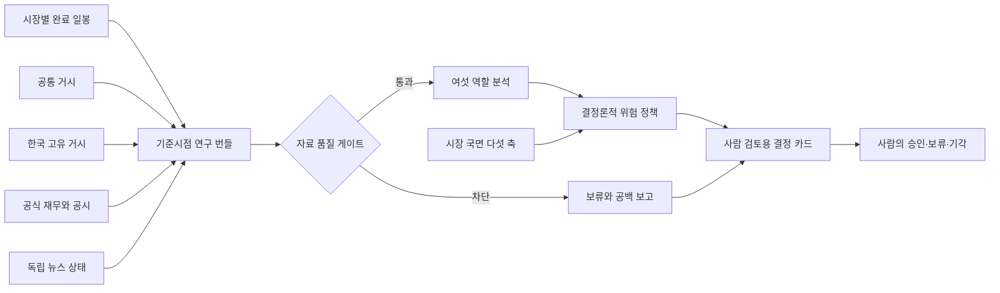

# 미국·한국 시장 연구 설계

## 목표

이 설계는 종목 점수를 많이 만드는 것이 아니라 같은 기준시점의 검증 가능한 사실을 미국과 한국 시장에 맞게 조립하고, 자료가 불완전할 때 긍정적인 결론이 실행 의견으로 넘어가지 못하게 하는 데 목적이 있습니다. 자동 주문은 범위에 포함하지 않습니다.

## 전체 구조

## 시장 분리

공통 거시는 미국과 한국에 동시에 영향을 주지만 민감도는 시장별로 따로 평가합니다.

| 구분 | 공통 사용 | 미국 시장 추가 | 한국 시장 추가 |
|---|---|---|---|
| 금리 | 미국 2년·3년·10년, 장단기 금리차 | 미국 국채 수익률 곡선 | 한국은행 기준금리와 국고채 3년·10년을 별도 평가 |
| 통화 | 연준 광의 달러지수, 원·달러 | 달러 강세와 해외 매출 민감도 | 원화 약세 수준과 변화에 더 높은 위험 상한 적용 |
| 변동성 | 변동성지수 수준과 변화 | 동일 | 동일하되 원화·외국인 흐름과 함께 해석 |
| 원자재 | 서부텍사스유와 브렌트유 | 업종·물가 영향 | 수입물가와 제조업 비용 영향 |
| 유동성 | 비트코인, 연준 총자산, 역레포 | 위험 선호 보조축 | 글로벌 위험 선호 보조축 |
| 성장·물가 | 미국 소비자물가, 근원물가, 실업률, 산업생산 | 직접 경기축 | 수출과 글로벌 수요의 공통 배경 |
| 한국 고유 거시 | 해당 없음 | 해당 없음 | 한국은행 기준금리, 국고채 3년·10년, 원·달러, 한국 소비자물가 |

시장 국면은 하나의 매수 점수로 합치지 않습니다. 금리·통화·변동성·원자재·유동성 다섯 축을 `우호`, `중립`, `비우호`, `미확인`으로 유지하고, 불리하거나 미확인인 축은 포지션 상한 계수만 낮춥니다.

## 출처 정책

| 자료 | 분석용 우선 출처 | 신선도·권리 정책 |
|---|---|---|
| 미국 금리 | [미국 재무부 일일 금리 자료](https://home.treasury.gov/treasury-daily-interest-rate-xml-feed) | 원공급원 XML에서 2년·3년·10년 금리와 장단기 차이를 계산합니다. |
| 미국 성장·물가 | [미국 노동통계국 공개 자료 인터페이스](https://www.bls.gov/developers/) | 소비자물가·근원물가·실업률을 원공급원에서 수집합니다. |
| 한국 거시 | [한국은행 경제통계시스템](https://ecos.bok.or.kr/api/) | 검증한 통계표와 항목 코드만 사용하고 키가 없으면 필수 구역을 차단합니다. |
| 미국 재무·공시 | [미국 증권거래위원회 자료 인터페이스](https://www.sec.gov/search-filings/edgar-application-programming-interfaces) | 회사 사실과 제출 메타데이터를 사용하며 공정 접근 사용자 식별자가 필요합니다. |
| 한국 재무·공시 | [금융감독원 전자공시](https://opendart.fss.or.kr/intro/main.do) | 인증키와 공시 접수일을 확인하고 본문 대신 검증 가능한 재무·공시 메타데이터를 저장합니다. |
| 한국 가격 | [공공데이터포털 주식시세](https://www.data.go.kr/data/15094808/openapi.do) | 통상 다음 영업일 자료임을 표시하고 비조정주가 한계를 경고합니다. |
| 미국 가격 | [티잉고 완료 일봉](https://www.tiingo.com/documentation/end-of-day) | 개인 내부 분석과 비재배포 조건을 따르며 조정 일봉을 우선 사용합니다. |
| 국내 뉴스 탐색 | [빅카인즈](https://www.bigkinds.or.kr/v2/intro/service.do), [네이버 개발자 안내](https://developers.naver.com/notice/article/32530) | 제목과 원문 위치를 찾는 탐색 단계로만 등록하고, 권리가 확인되지 않은 본문을 분석 저장하지 않습니다. |
| 계약 뉴스 | [로이터 커넥트 이용조건](https://www.reutersconnect.com/general-terms) | 인공지능 분석과 저장 권리가 계약으로 확인될 때까지 비활성입니다. |

[FRED 공식 약관](https://fred.stlouisfed.org/legal/)은 생성형 인공지능 연계와 저장·캐시를 금지하므로 공통 거시 수집 경로에서 비활성화했습니다. [야후 공식 약관](https://legal.yahoo.com/xw/en/yahoo/terms/otos/index.html)도 사전 허가 없는 자동 수집을 허용하지 않으므로 가격 대체 경로로 사용하지 않습니다. 미국 가격은 계약된 티잉고, 한국 가격은 공공데이터포털이 준비되지 않으면 명시적으로 사용 불가가 됩니다.

광의 달러, 변동성지수, 원유와 연준 유동성은 각각 연준 이사회·권리 확인된 거래소 또는 계약 공급원·미국 에너지정보청 원자료 어댑터가 연결되기 전까지 필수 차단 상태를 유지합니다. 화면에는 확보하지 못한 축을 `미확인`으로 표시하며 다른 지표로 추정해 채우지 않습니다.

## 사실 원장과 기준시점

각 사실은 다음 항목을 가집니다.

- 시장과 종목을 분리한 정규 식별자.
- 출처 식별자와 공식 주소.
- 지표 이름, 값, 단위와 통화.
- 관측 시각, 공개 시각, 수집 시각.
- 공개 시각이 공식 보고값인지 수집 시각 대용값인지 나타내는 근거 구분.
- 정정 차수와 기준시점.

에이전트는 입력 사실 식별자만 선택합니다. 사람이 보는 근거 문구, 값, 단위, 주소와 공개 시각은 서버가 사실 원장에서 다시 만들며 모델이 작성한 자유 문장을 검증된 근거로 저장하지 않습니다. 과거 기준시점보다 늦게 관측되거나 공개된 사실은 번들에서 제외하고, 실제 공개시각이 없는 수집 시각 대용 사실은 과거 기준시점 분석에서 자동 제외합니다.

## 자료 품질 게이트

필수 구역은 다음과 같습니다.

- 현재가·직전가·일간 수익률·변동폭·20일 변동성과 최소 일봉 수.
- 공통 거시 여섯 구역.
- 한국 종목의 한국은행 거시 구역.
- 공식 재무제표.
- 내용이 확인된 공식 공시 이벤트.
- 검증 가능한 독립 언론 뉴스 커버리지.

선택 구역은 이동평균·상대강도 등 부가 기술 지표와 입력이 충분할 때만 계산하는 밸류에이션 비율입니다. 독립 언론 뉴스는 신규 포지션 판단의 필수 구역이며 공급원이 없으면 분석 기록은 남기되 매수 비중은 0으로 고정합니다.

다음 조건은 신규 포지션을 차단합니다.

- 필수 구역이 부분 수집, 사용 불가 또는 차단 상태인 경우.
- 필수 사실이 허용 수명을 넘은 경우.
- 사실과 출처 식별자, 종목 또는 기준시점 참조가 충돌한 경우.
- 기본면이나 공식 공시 입력이 비어 있는 경우.

차단되더라도 분석 실행 기록과 공백 보고는 남습니다. 위험 정책은 `eligible=false`, 비중 상한 `0`, 실행 의견 `보류` 또는 더 강한 `회피`로 고정합니다.

## 재무와 비율

미국 회사 사실과 한국 전자공시에서 매출, 영업이익, 순이익, 자본, 자산, 부채, 희석 주당이익, 영업현금흐름과 설비투자를 수집합니다. 주가수익비율, 자기자본이익률, 총자산이익률과 주가순자산비율은 필요한 기간·발행주식수·평균 잔액이 모두 확보될 때만 계산합니다.

현재 계약은 다중 원천 파생 계보를 완전히 표현할 수 없는 비율을 임의 계산하지 않습니다. 계산할 수 없는 비율은 값 대신 필요한 입력을 구체적인 자료 공백으로 남깁니다. 이 정책은 잘못된 분기 이익의 연환산이나 시점이 다른 분모 사용을 막기 위한 것입니다.

## 뉴스 적용

공시 양식·접수번호·파일명만 있는 메타데이터는 뉴스 분석 완료로 인정하지 않습니다. 내용이 확인된 공식 기업 사건과 권리가 확인된 독립 언론 커버리지가 모두 있어야 신규 포지션 품질 게이트를 통과합니다. 전문 이용권 제공자를 연결할 때도 제목 검색과 원문 분석 권한을 분리하고, 중복 기사 묶음·발행 시각·정정 여부·회사 연결 신뢰도를 저장해야 합니다.

## 운영과 보안

- 모든 변경 인터페이스는 로컬 호스트와 같은 출처 요청만 허용합니다.
- 외부 인증값은 설정 객체의 출력, 출처 주소, 오류 메시지와 에이전트 입력에 포함하지 않습니다.
- 데이터베이스 스키마 변경 없이 기존 스냅샷 제이슨에 새 계약을 저장합니다.
- 분석 중 공급자 하나가 실패해도 다른 자료와 명시적인 실패 구역을 반환합니다.
- 무인증 미국 노동통계국 호출 한도를 넘지 않도록 공통 거시는 4시간 동안 캐시하고 동시 요청을 하나로 합칩니다.
- 저장된 결정 카드는 언제나 사람 승인 필요와 자동 주문 금지를 유지합니다.

## 현재 한계

- 전문 독립 뉴스 본문은 아직 분석 입력에 연결하지 않았으므로 현재 신규 포지션은 안전하게 차단됩니다.
- 일부 기업은 공식 공시 항목 차이 때문에 모든 재무 지표를 확보하지 못할 수 있습니다.
- 한국 공식 가격은 다음 영업일 반영이며, 공급 장애 때 비공식 가격으로 대체하지 않습니다.
- 광의 달러·변동성·원유·연준 유동성 축은 권리 확인된 원공급원 어댑터가 연결될 때까지 미확인 상태입니다.
- 포트폴리오 전체 상관관계, 세금, 수수료와 개인 보유 내역은 결정 카드에 자동 반영되지 않습니다.
- 2차원 게임 화면은 분석 검증이 안정된 뒤 마지막 순서로 진행합니다.
